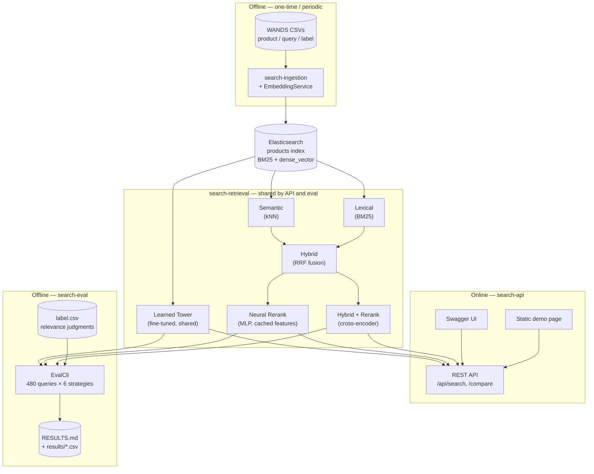

# Architecture

Module layout, data flow, the six ranking strategies, the key design
decisions behind them, and a few implementation gotchas worth knowing
before you go digging in the code. See [WRITEUP.md](WRITEUP.md) for the
narrative of *why* these decisions were made and what was learned along
the way; this doc is the reference.

## Module layout

Six-module Maven reactor:

```
search/
├── search-common/      domain models + WANDS CSV parsing (no framework deps)
├── search-inference/   ONNX Runtime + tokenizer wrappers — embedding & reranker services
├── search-retrieval/   Elasticsearch client + 6 pluggable SearchStrategy impls + RRF fusion
├── search-ingestion/   CLI: index creation + bulk indexing with embeddings
├── search-api/         thin Spring Boot REST API over search-retrieval
└── search-eval/        CLI: offline IR evaluation harness against label.csv
```

`search-retrieval` is framework-agnostic and shared by both `search-api` and
`search-eval`, so the evaluation harness scores the *exact same* strategy code
the API serves — no risk of eval measuring something different from
production:



## The six ranking strategies

Each a `SearchStrategy` implementation:

1. **Lexical** — BM25 (`multi_match` across name/class/category/description/features)
2. **Semantic** — dense kNN search over `bge-small-en-v1.5` embeddings
3. **Hybrid** — client-side RRF fusion of the two ranked lists above
4. **Hybrid + Rerank** — top-50 from Hybrid, rescored by the cross-encoder, top-10 returned
5. **Neural Rerank** — top-50 from Hybrid, rescored by a small MLP over 6 cheap,
   mostly-cached features (RRF score, embedding cosine similarity, lexical
   term overlap, category match, rating, review count) instead of a
   transformer pass — ~85x faster than the cross-encoder, but scores lower
   on nDCG@10 than Hybrid alone; see [WRITEUP.md](WRITEUP.md) for the honest
   account of why
6. **Learned Tower** — dense kNN search over `bge-small-en-v1.5` fine-tuned
   on WANDS itself (one shared encoder for both queries and products — beat
   a two-tower alternative with separate encoders in a head-to-head, but
   scores lower than the off-the-shelf pretrained model); see
   [WRITEUP.md](WRITEUP.md) for both findings

## Key decisions

| Decision | Choice | Why |
|---|---|---|
| Dataset | [WANDS](https://github.com/wayfair/WANDS) — Wayfair furniture catalog | Ships with `product.csv`, `query.csv`, and `label.csv` (human relevance judgments: Exact/Partial/Irrelevant), which is what makes real IR metrics possible instead of a "looks reasonable" demo. |
| Stack | Java, embeddings + reranking run in-process via **ONNX Runtime** | No Python inference server anywhere — a deliberate differentiator, since most semantic-search portfolios are Python end to end. |
| Search engine | **Elasticsearch** | Considered OpenSearch first (its native RRF fusion is fully open-source, vs. Elasticsearch's being Platinum-gated). But this project hand-rolls RRF fusion client-side in Java rather than using either engine's built-in fusion endpoint (see below), so that licensing distinction turned out not to matter. Elasticsearch was chosen as the more resume-recognizable name; free/Basic license fully covers what's needed here (BM25 + `dense_vector`/kNN). |
| Hybrid fusion | Hand-rolled Reciprocal Rank Fusion (RRF) in Java, not a built-in engine endpoint | More demoable and independently unit-testable than flipping a config flag — it's the artifact that proves understanding of the algorithm, and it gives the eval harness full control to sweep the RRF constant. |
| Embedding model | `BAAI/bge-small-en-v1.5` (384-dim), via pre-exported ONNX weights from `Xenova/bge-small-en-v1.5` | Purpose-built for retrieval, small, and requires no local Python export step. Unlike most sentence-embedding models, BGE is trained with CLS-token pooling (first token of `last_hidden_state`) rather than mean pooling, and needs an asymmetric instruction prefix on queries only, not documents — both easy to get wrong silently since a mean-pooled embedding still "works," just worse; documented in `EmbeddingService`. |
| Reranker | `cross-encoder/ms-marco-MiniLM-L-6-v2`, via `Xenova/ms-marco-MiniLM-L-6-v2`'s **INT8-quantized** ONNX export | Standard MS MARCO cross-encoder. Scoring a 50-candidate pool is one forward pass over a batch of 50 (query, document) pairs — real single-query cost measured at ~1.3s p95 even quantized (quantization roughly halved it from the fp32 export's ~3s), nowhere near "well under 100ms"; a materially heavier workload than the embedding model's batch-of-1 query encode, so it gets the INT8 export while the embedding model stays fp32 (quantizing that would change every stored vector, invalidating the already-recorded M1–M3 numbers). |
| Tokenization in Java | `ai.djl.huggingface:tokenizers` (standalone, not the full DJL engine) | The one piece Java lacks natively — loads `tokenizer.json` directly via JNI binding to the Rust `tokenizers` library, paired with raw ONNX Runtime for the forward pass. |
| Build tool | Maven, multi-module reactor | Declarative XML dependency graphs are easy for a reviewer to skim; no build-script logic to audit. |

## Implementation notes

WANDS files have a `.csv` extension but are actually **tab-delimited**, and
the category column is literally named `category hierarchy` (space, not
underscore) — both discovered by inspecting the raw bytes, not the (comma-
delimited) assumption in the original design doc. `WandsCsvLoader` parses
accordingly. Category values also have inconsistent whitespace around `/`
(e.g. `"Furniture / Beds"`), so `EmbeddingTextBuilder` normalizes with a
regex rather than a plain string replace — a naive replace produced
double-spaced text and was caught by a unit test.

`product_features` (pipe-delimited attribute:value pairs) is indexed as a
separate lexical field but deliberately excluded from the embedding text —
attribute noise dilutes sentence-embedding quality more than it helps.

`search-eval` measures p95 latency serially, one query at a time over a
fixed 50-query sample — separately from the metrics computation, which
still runs all 480 queries concurrently since that's just correctness, not
timing. Firing all 480 queries at once as a single burst was the original
design, and it's fine for the cheap strategies, but for the reranker
(~1.3s of genuine per-query cross-encoder work) it measured queueing delay
behind the burst, not realistic single-query latency — a first pass showed
a nonsensical multi-minute p95 that was actually ~480 queries stacked up
behind each other on one CPU, not the model being slow. `RerankerService`
also pins its ONNX session to a single intra-op thread and gates concurrent
forward passes with a semaphore sized to the core count, so that concurrent
callers (e.g. multiple simultaneous API requests) share the CPU instead of
each spawning their own full-width thread pool and thrashing it.

## See also

- [WRITEUP.md](WRITEUP.md) — the narrative: what was tried, what broke, what the numbers showed
- [RESULTS.md](RESULTS.md) — the canonical, always-current evaluation numbers
- [TRAINING.md](TRAINING.md) — the two custom-trained models
- [CI.md](CI.md) — the CI pipeline and security posture
- [HOWTO.md](HOWTO.md) — running it locally
