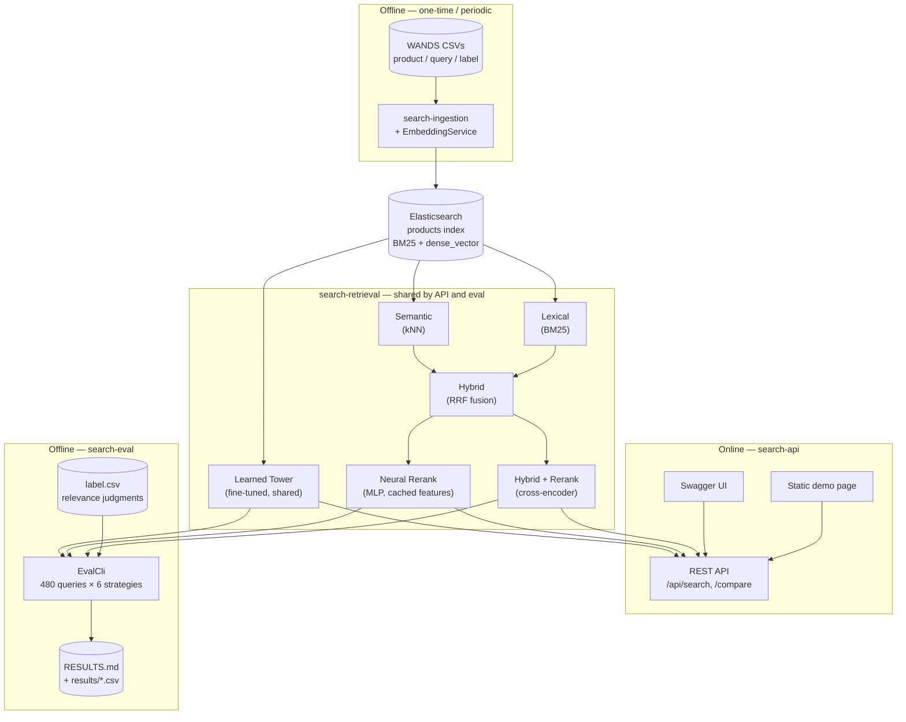

# Semantic Product Search

A Java service for semantic product search over the [WANDS](https://github.com/wayfair/WANDS)
(Wayfair) furniture catalog. Built as a long-term portfolio project focused on one
thing: **retrieval and ranking quality** — hybrid lexical/semantic search plus
cross-encoder reranking, proven with real offline IR evaluation (nDCG, MRR,
Recall@k) rather than eyeballed results. Sibling portfolio project to
[`recommendation-engine`](https://github.com/avantiwhenever/recommendation-engine)
(a React + GraphQL recommendation engine over the same catalog) — that one
explores a different problem (personalized re-ranking) and a more
service-oriented stack; this one goes deep on one thing instead: proving each
stage of a ranking pipeline actually improves search quality, with the
numbers to back it up.

> **[Live snapshot demo →](https://avantiwhenever.github.io/search/)** — a
> few real, captured queries comparing all six strategies side by side
> (static GitHub Pages page, not a live backend — [run it yourself](HOWTO.md)
> for the real thing, or see [WRITEUP.md](WRITEUP.md) for the full narrative).

## Reading this README

This page serves a few different readers. Pick the path that fits — each is
short and self-contained, no need to read the others first.

<details>
<summary><strong>I'm a recruiter / skimming this — what is it? (30 seconds)</strong></summary>

A working, from-scratch Java search engine over a real 43,000-product
furniture catalog, offering six selectable ranking strategies — from plain
keyword search up to a cross-encoder reranker and a fine-tuned neural
embedding model — with real precision/recall numbers proving which ones
actually work better, not just a demo that "looks reasonable." All
inference (embeddings, reranking) runs in-process via ONNX Runtime — no
Python inference server anywhere. It's paired with a sibling project,
[`recommendation-engine`](https://github.com/avantiwhenever/recommendation-engine),
which takes a more service-oriented approach to a related problem over the
same catalog. [See the live snapshot demo →](https://avantiwhenever.github.io/search/)

</details>

<details>
<summary><strong>I'm curious about the ranking strategies specifically</strong></summary>

Six strategies, each documented below with how it works, plus its real
offline-evaluation numbers in the results table further down — see
[RESULTS.md](RESULTS.md) for the raw per-query CSVs and methodology, and
[WRITEUP.md](WRITEUP.md) for the honest narrative of what beat what (and,
just as importantly, what didn't).

</details>

<details>
<summary><strong>I'm a technical hiring manager — what does this actually demonstrate? (2 minutes)</strong></summary>

Concrete, verifiable engineering signal, not a tutorial-follow-along project:

- **Rigorous, not eyeballed, evaluation**: every ranking stage is scored
  against WANDS' real human relevance judgments (nDCG, MRR, Recall@k,
  Precision@k) plus measured p95 latency — a full results table with
  per-query CSVs, not a handful of cherry-picked examples. See
  [RESULTS.md](RESULTS.md).
- **Two models trained from scratch, with honest reporting**: a
  feature-based MLP reranker and a fine-tuned embedding tower (see
  [TRAINING.md](TRAINING.md)) — both evaluated on a held-out query split,
  and reported honestly even where they *didn't* beat their baseline. See
  [WRITEUP.md](WRITEUP.md).
- **All-Java ML serving, no Python inference server**: embeddings and
  cross-encoder reranking both run in-process via ONNX Runtime plus a
  native Rust tokenizer binding — a deliberate differentiator, since most
  semantic-search portfolios are Python end to end.
- **Production-adjacent engineering hygiene**: CI with dependency/image
  vulnerability scanning (Trivy), SAST (Semgrep), secret scanning
  (gitleaks) and push protection, Dependabot, a CI-run test suite, and a
  documented Docker-first local setup — see CI below.

</details>

<details>
<summary><strong>I'm reviewing this codebase — where do I start?</strong></summary>

Start with the Architecture section below for the module layout and the
data-flow diagram, then [WRITEUP.md](WRITEUP.md) for the narrative of what
was tried at each milestone, what broke, and how the final numbers were
arrived at — it's the closest thing this project has to a reviewer's tour.
[HOWTO.md](HOWTO.md) gets it running locally, with a verification step
after each stage.

</details>

## Why this project

Most semantic-search portfolios are a thin wrapper around a vector DB with
no evaluation story. This one is built to demonstrate a few things most
such projects skip:

1. **That each stage of the pipeline earns its keep, provably** —
   lexical → semantic → hybrid → reranked → neural → fine-tuned tower —
   measured against WANDS' real human relevance judgments at every step,
   not just at the end.
2. **Two models trained from scratch on this project's own data** (a
   feature-based MLP reranker, and a fine-tuned embedding tower), reported
   honestly including the ones that didn't beat their baseline — see
   [WRITEUP.md](WRITEUP.md).
3. **All-Java ML inference** — ONNX Runtime plus a native tokenizer
   binding, no Python serving path — a deliberate differentiator, since
   most semantic-search demos are Python end to end.
4. **Production-adjacent CI/security posture** (CVE scanning, SAST, secret
   scanning, Dependabot) that's uncommon at portfolio scale.

**The honest tradeoff**: six competing ranking strategies plus a
from-scratch fine-tuned embedding tower is more machinery than a
43,000-product, single-tenant, no-real-traffic system actually needs in
production. This is here to demonstrate IR-evaluation rigor and Java-native
ML serving competency on purpose, not because this catalog size needs six
strategies live at once. A system this size built to actually ship would
likely keep just the best-measured strategy or two (Hybrid, or Hybrid +
Rerank if the latency budget allows) rather than all six — the eval
harness's job is precisely to make that kind of call defensible with
numbers instead of guesswork.

## Key decisions

| Decision | Choice | Why |
|---|---|---|
| Dataset | [WANDS](https://github.com/wayfair/WANDS) — Wayfair furniture catalog | Ships with `product.csv`, `query.csv`, and `label.csv` (human relevance judgments: Exact/Partial/Irrelevant), which is what makes real IR metrics possible instead of a "looks reasonable" demo. |
| Stack | Java, embeddings + reranking run in-process via **ONNX Runtime** | No Python inference server anywhere — a deliberate differentiator, since most semantic-search portfolios are Python end to end. |
| Search engine | **Elasticsearch** | Considered OpenSearch first (its native RRF fusion is fully open-source, vs. Elasticsearch's being Platinum-gated). But this project hand-rolls RRF fusion client-side in Java rather than using either engine's built-in fusion endpoint (see below), so that licensing distinction turned out not to matter. Elasticsearch was chosen as the more resume-recognizable name; free/Basic license fully covers what's needed here (BM25 + `dense_vector`/kNN). |
| Hybrid fusion | Hand-rolled Reciprocal Rank Fusion (RRF) in Java, not a built-in engine endpoint | More demoable and independently unit-testable than flipping a config flag — it's the artifact that proves understanding of the algorithm, and it gives the eval harness full control to sweep the RRF constant. |
| Embedding model | `BAAI/bge-small-en-v1.5` (384-dim), via pre-exported ONNX weights from `Xenova/bge-small-en-v1.5` | Purpose-built for retrieval, small, and requires no local Python export step. Unlike most sentence-embedding models, BGE is trained with CLS-token pooling (first token of `last_hidden_state`) rather than mean pooling, and needs an asymmetric instruction prefix on queries only, not documents — both easy to get wrong silently since a mean-pooled embedding still "works," just worse; documented in `EmbeddingService`. |
| Reranker | `cross-encoder/ms-marco-MiniLM-L-6-v2`, via `Xenova/ms-marco-MiniLM-L-6-v2`'s **INT8-quantized** ONNX export | Standard MS MARCO cross-encoder. Scoring a 50-candidate pool is one forward pass over a batch of 50 (query, document) pairs — real single-query cost measured at ~1.3s p95 even quantized (quantization roughly halved it from the fp32 export's ~3s), nowhere near "well under 100ms"; a materially heavier workload than the embedding model's batch-of-1 query encode, so it gets the INT8 export while the embedding model stays fp32 (quantizing that would change every stored vector, invalidating the already-recorded M1–M3 numbers). |
| Tokenization in Java | `ai.djl.huggingface:tokenizers` (standalone, not the full DJL engine) | The one piece Java lacks natively — loads `tokenizer.json` directly via JNI binding to the Rust `tokenizers` library, paired with raw ONNX Runtime for the forward pass. |
| Build tool | Maven, multi-module reactor | Declarative XML dependency graphs are easy for a reviewer to skim; no build-script logic to audit. |

## Architecture

Six-module Maven reactor:

```
search/
├── search-common/      domain models + WANDS CSV parsing (no framework deps)
├── search-inference/   ONNX Runtime + tokenizer wrappers — embedding & reranker services
├── search-retrieval/   Elasticsearch client + 6 pluggable SearchStrategy impls + RRF fusion
├── search-ingestion/   CLI: index creation + bulk indexing with embeddings
├── search-api/         thin Spring Boot REST API over search-retrieval
└── search-eval/        CLI: offline IR evaluation harness against label.csv
```

`search-retrieval` is framework-agnostic and shared by both `search-api` and
`search-eval`, so the evaluation harness scores the *exact same* strategy code
the API serves — no risk of eval measuring something different from
production:



Six ranking strategies, each a `SearchStrategy` implementation:
1. **Lexical** — BM25 (`multi_match` across name/class/category/description/features)
2. **Semantic** — dense kNN search over `bge-small-en-v1.5` embeddings
3. **Hybrid** — client-side RRF fusion of the two ranked lists above
4. **Hybrid + Rerank** — top-50 from Hybrid, rescored by the cross-encoder, top-10 returned
5. **Neural Rerank** — top-50 from Hybrid, rescored by a small MLP over 6 cheap,
   mostly-cached features (RRF score, embedding cosine similarity, lexical
   term overlap, category match, rating, review count) instead of a
   transformer pass — ~85x faster than the cross-encoder, but scores lower
   on nDCG@10 than Hybrid alone; see [WRITEUP.md](WRITEUP.md) for the honest
   account of why
6. **Learned Tower** — dense kNN search over `bge-small-en-v1.5` fine-tuned
   on WANDS itself (one shared encoder for both queries and products — beat
   a two-tower alternative with separate encoders in a head-to-head, but
   scores lower than the off-the-shelf pretrained model); see
   [WRITEUP.md](WRITEUP.md) for both findings

## Roadmap

- [x] **M0 — Environment + scaffolding.** Toolchain installed (JDK 21, Maven,
      Colima/Docker), Maven reactor scaffolded, Elasticsearch + Kibana running
      via Docker Compose, WANDS dataset downloaded, `search-common` domain
      models + CSV parsing + unit tests.
- [x] **M1 — Lexical baseline + eval harness.** `LexicalSearchStrategy`, index
      mapping/creation, bulk ingestion of all ~43K products, full
      `search-eval` pipeline, first row of the results table.
- [x] **M2 — Embeddings + semantic search + eval.** `EmbeddingService`
      (ONNX + tokenizer, CLS-pool, normalize, BGE query-prefix handling),
      `dense_vector` field, `SemanticSearchStrategy`, second results row.
- [x] **M3 — Hybrid + RRF + eval.** `RrfFusionService`,
      `HybridRrfSearchStrategy`, sweep of the RRF constant, third results row.
- [x] **M4 — Cross-encoder rerank + eval.** `RerankerService`,
      `HybridRerankStrategy`, fourth results row, latency measurement.
- [x] **M5 — Polish.** Swagger UI, `/api/search/compare` side-by-side
      endpoint, minimal demo surface, Dockerized `search-api`, architecture
      diagram, full write-up.
- **M6+ — ongoing.**
  - [x] CI-enforced eval — see below.
  - [x] Feature-based neural reranker (`NeuralRerankStrategy`,
        `RerankFeatureBuilder`, `ProductFeatureCache`, fifth results row) —
        trained via `scripts/train-neural-reranker.sh`, evaluated on a
        held-out 20% query split. Didn't beat Hybrid on nDCG@10; kept as a
        documented latency/quality tradeoff point, not a replacement for
        the cross-encoder. See [WRITEUP.md](WRITEUP.md).
  - [x] Fine-tuned embedding tower comparison (`LearnedTowerSearchStrategy`,
        sixth results row) — `bge-small-en-v1.5` fine-tuned on WANDS in two
        configurations (shared encoder vs. true two-tower), compared via
        `training/train_embedding_towers.py` + the real eval harness on a
        held-out split. Shared-tower won the head-to-head but neither beat
        the off-the-shelf pretrained model. See [WRITEUP.md](WRITEUP.md).
  - [ ] Server-side RRF comparison, query understanding, a pairwise/listwise
        ranking loss for the neural reranker instead of pointwise MSE, more
        training data for the tower fine-tune, observability.

See [TRAINING.md](TRAINING.md) for complete setup, process, and results for
both of this project's own trained models (the feature-based neural
reranker and the fine-tuned embedding tower comparison).

## Offline evaluation

Every strategy is scored against WANDS' real human relevance judgments
across 480 queries (nDCG@10, MRR, Recall@10/50, Precision@10), plus
measured p95 latency — not a single flattering metric, and not eyeballed
examples. Target results table (filled in as milestones landed):

| Strategy | nDCG@10 | MRR | Recall@10 | Recall@50 | Precision@10 | p95 latency |
|---|---|---|---|---|---|---|
| Lexical (BM25) | 0.6694 | 0.8794 | 0.0613 | 0.2482 | 0.7923 | 2ms |
| Semantic (bge-small-en-v1.5) | 0.6982 | 0.8900 | 0.0579 | 0.2288 | 0.7990 | 5ms |
| Hybrid (RRF, k=40) | 0.7295 | 0.9202 | 0.0639 | 0.2502 | 0.8450 | 7ms |
| Hybrid + Cross-Encoder Rerank | 0.7447 | 0.9037 | 0.0642 | 0.2502 | 0.8362 | 1248ms |
| Neural Rerank (MLP)* | 0.6809 | 0.8555 | 0.0613 | 0.2731 | 0.8021 | 12ms |
| Learned Tower (fine-tuned, shared)* | 0.6603 | 0.8559 | 0.0559 | 0.2284 | 0.7729 | 6ms |

\* Scored on the held-out 20% of queries only (96 of 480) — see
[WRITEUP.md](WRITEUP.md) for why these two rows aren't directly comparable
row-for-row with the other four, and for the honest write-up of why
neither beats its respective baseline (Hybrid, and off-the-shelf
`bge-small-en-v1.5`, in order).

See [RESULTS.md](RESULTS.md) (regenerate with `./scripts/run-eval.sh`) for
the canonical, always-current version of this table plus per-query CSVs
under `results/`.

## CI

One GitHub Actions workflow, `.github/workflows/build.yml`, six jobs on every push/PR:

- **`test`** — `mvn test`. Fast, needs no Elasticsearch or models (the
  tests that do need them skip gracefully via `Assumptions.assumeTrue`
  when those aren't present).
- **`cve-scan`** — Trivy against every module's resolved `pom.xml`
  dependency tree (SCA), failing on CRITICAL/HIGH/MEDIUM known CVEs.
  Reproduce locally with `./scripts/scan-cves.sh`.
- **`sast`** — Semgrep over the Java (and Python training) source itself
  — not just its dependencies — with the `p/java`, `p/security-audit`,
  and `p/secrets` rulesets.
- **`secret-scan`** — gitleaks against the full commit history, so a
  credential can't slip in and get baked into an image layer later.
- **`docker-lint`** — hadolint against `search-api/Dockerfile` (this is
  what caught that the non-root `USER` directive should be numeric
  `1000:1000`, not a name, for portability to orchestrators that don't
  read `/etc/passwd`).
- **`docker-image-scan`** — builds the real `search-api` runtime image
  and scans it (OS + JRE layer, not just the jar's dependencies) with
  Trivy, plus generates a CycloneDX SBOM as a build artifact via Syft.

`cve-scan`, `sast`, and `docker-image-scan` each run their scanner twice:
once in the format that gates the job (`table` + `exit-code: 1`), once as
SARIF uploaded via `github/codeql-action/upload-sarif` so findings also
land in the repo's **Security → Code scanning** tab instead of only
CI logs — non-blocking, so a SARIF upload hiccup never fails the job.

Repo-level (not workflow files, so not visible in `.github/`, but part of
the same posture): **Dependabot version updates** (`.github/dependabot.yml`
— weekly, covering the Maven reactor, `search-api/Dockerfile`, and the
Actions workflow itself), plus **Dependabot alerts**, **Dependabot
security updates**, **secret scanning**, and **secret scanning push
protection** all enabled in repo settings — free for a public repo, and
the platform-native complement to the gitleaks/Trivy checks above (push
protection in particular blocks a secret *before* it's pushed, which a
CI-time scan structurally can't).

Deliberately **not** in this pipeline: Cosign image signing and registry
immutability controls. Those protect a *registry* this project doesn't
have — there's no ECR/Harbor push step, so wiring up signing would be
config theater, not a real control. Worth adding the day this project
(or reader's fork of it) actually pushes images somewhere.

The full-catalog regression eval (ingest all ~43K products with real
embeddings, run all 480 WANDS queries against all four strategies, fail if
any strategy's nDCG@10 drops below the floor in `ci/eval-baseline.json`) is
**not** run in CI — embedding 43K products is genuinely slow, and that cost
doesn't belong on a shared runner on every push. Run it locally instead:

```
./scripts/run-eval.sh --baseline-file ci/eval-baseline.json
```

against a local Elasticsearch instance (see `docker-compose.yml`). Omit
`--baseline-file` to just regenerate `RESULTS.md` without gating.

## Data notes

WANDS files have a `.csv` extension but are actually **tab-delimited**, and
the category column is literally named `category hierarchy` (space, not
underscore) — both discovered by inspecting the raw bytes, not the (comma-
delimited) assumption in the original design doc. `WandsCsvLoader` parses
accordingly. Category values also have inconsistent whitespace around `/`
(e.g. `"Furniture / Beds"`), so `EmbeddingTextBuilder` normalizes with a
regex rather than a plain string replace — a naive replace produced
double-spaced text and was caught by a unit test.

`product_features` (pipe-delimited attribute:value pairs) is indexed as a
separate lexical field but deliberately excluded from the embedding text —
attribute noise dilutes sentence-embedding quality more than it helps.

`search-eval` measures p95 latency serially, one query at a time over a
fixed 50-query sample — separately from the metrics computation, which
still runs all 480 queries concurrently since that's just correctness, not
timing. Firing all 480 queries at once as a single burst was the original
design, and it's fine for the cheap strategies, but for the reranker
(~1.3s of genuine per-query cross-encoder work) it measured queueing delay
behind the burst, not realistic single-query latency — a first pass showed
a nonsensical multi-minute p95 that was actually ~480 queries stacked up
behind each other on one CPU, not the model being slow. `RerankerService`
also pins its ONNX session to a single intra-op thread and gates concurrent
forward passes with a semaphore sized to the core count, so that concurrent
callers (e.g. multiple simultaneous API requests) share the CPU instead of
each spawning their own full-width thread pool and thrashing it.

## Local setup

See **[HOWTO.md](HOWTO.md)** for step-by-step instructions to get
Elasticsearch, the WANDS catalog, and `search-api` running locally — each
step includes how to verify it actually worked before moving to the next
one (e.g. confirming `search-api` is up and pollable on `localhost:8080`),
plus how to run everything via Docker Compose or from IntelliJ.

## Reviewing this code

See **[WRITEUP.md](WRITEUP.md)** for the full narrative: what was tried at
each milestone, what broke, and how the final numbers were arrived at — the
closest thing this project has to a reviewer's tour. Come back to this
README for the "why" behind specific decisions (Key decisions table above)
and [HOWTO.md](HOWTO.md) to actually run it.
